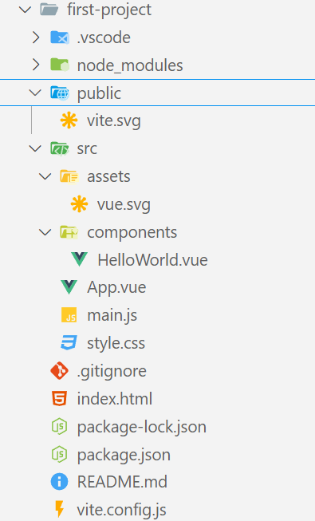

### 1. Giới thiệu về Vue

#### 1.1. Vue là gì?

Vue là một framework Javascript dùng để xây dựng hiệu quả những giao diện người dùng phức phức tạp và ứng dụng web đơn trang (Single Page Application)

#### 1.2. Sức mạnh của Vue (Core features)

- **Reactivity System**: Vue cung cấp một hệ thống phản ứng mạnh mẽ, giúp cập nhật giao diện tự động khi có dữ liệu thay đổi
- **Virtual DOM (DOM ảo)**: Vue sử dụng Virtual DOM để tối ưu hiệu suất, giúp giảm số lần thao tác trực tiếp lên DOM thực
- **Declarative Rendering**: Giúp bạn khai báo giao diện bằng dữ liệu, thay vì thao tác trực tiếp với DOM. Vue sẽ tự động cập nhật giao diện khi dữ liệu thay đổi.
- **Directives**: Vue cung cấp các Directives giúp thao tác với DOM dễ dàng hơn
- **Components**: Vue chia ứng dụng thành các thành phần nhỏ (Components) giúp tái sử dụng và quản lý dễ dàng hơn
- **Event Handling**: Vue cho phép bắt sự kiện dễ dàng với `v-on` hoặc `@`
- **Lifecycle Hooks**: Vue cung cấp các hooks để ta có thể can thiệp vào vòng đời của một component

### 2. Khởi tạo Project đầu tiên

Để có thể khởi tạo một Project VueJS đầu tiên, chúng ta cần cài đặt môi trường NodeJS. Tại sao lại cần cài đặt môi trường NodeJS? Để trả lời cho câu hỏi này, thì chúng ta sẽ đi qua sơ qua về **Build tool**.

**Build tool** chính là công cụ giúp xử lý, tối ưu, và đóng góp mã nguồn của bạn trước khi chạy trên trình duyệt hoặc môi trường sản phẩm production. Có thể kể đến như **Build tool Vite** có cơ chế Hot Module Replacement(HMR) giúp cập nhật thay đổi trong code mà không cần reload lại toàn bộ trang. Ví dụ như khi ta sửa file `.vue`, chỉ phần code bị thay đổi sẽ được cập nhật ngay lập tức

Vậy thì để có thể cài đặt **Build tool** , ta cần cài đặt môi trường Node

#### 2.1. Cài đặt môi trường Node, Vite

[Hướng dẫn cài đặt môi trường NodeJS](https://howkteam.vn/course/khoa-hoc-javascript-co-ban/tai-va-cai-dat-moi-truong-nodejs-4338)

##### **1. npm là gì?**

**npm** (_Node Package Manager_) là trình quản lý gói (package manager) mặc định của **Node.js**. Nó giúp cài đặt, quản lý và chia sẻ các thư viện JavaScript trong dự án.

🔹 **Chức năng chính của npm:**

- Cài đặt thư viện (**packages**) từ **npm registry**.
- Quản lý dependencies trong dự án (**package.json**).
- Chạy các script hỗ trợ phát triển (`npm run dev`, `npm start`).
- Hỗ trợ **caching** để tối ưu tốc độ cài đặt.

🛠 **Cài npm**:  
npm được cài sẵn khi bạn cài **Node.js**. Kiểm tra phiên bản bằng lệnh:

```sh
npm -v
```

⚡ **Ví dụ sử dụng npm:**

- **Cài thư viện Vue:**
  ```sh
  npm install vue
  ```
- **Cài thư viện và lưu vào package.json:**
  ```sh
  npm install axios --save
  ```
- **Cài thư viện cho môi trường dev (devDependencies):**
  ```sh
  npm install eslint --save-dev
  ```
- **Xoá thư viện:**
  ```sh
  npm uninstall axios
  ```

---

##### **2. yarn là gì?**

**Yarn** (_Yet Another Resource Negotiator_) cũng là một **package manager** giống như npm nhưng được phát triển bởi **Facebook**.

🔹 **Ưu điểm của Yarn so với npm:**

- **Tốc độ nhanh hơn** (vì dùng caching tốt hơn).
- **Cài đặt song song** (tối ưu hiệu suất).
- **Tự động tạo `yarn.lock`** giúp đồng bộ dependencies.

🛠 **Cài Yarn** (nếu chưa có):

```sh
npm install -g yarn
```

Kiểm tra phiên bản:

```sh
yarn -v
```

⚡ **Ví dụ sử dụng Yarn:**

- **Cài thư viện:**
  ```sh
  yarn add vue
  ```
- **Cài thư viện devDependencies:**
  ```sh
  yarn add eslint --dev
  ```
- **Gỡ bỏ thư viện:**
  ```sh
  yarn remove axios
  ```

#### 2.2. Tạo ứng dụng Vuejs đầu tiên với Vite

- Hướng dẫn cài đặt từ A -> Z

#### 2.3. Cấu trúc thư mục trong Vue



| **Thư mục/File**    | **Chức năng**                                              |
| ------------------- | ---------------------------------------------------------- |
| `.vscode/`          | Cấu hình VS Code (cá nhân).                                |
| `node_modules/`     | Thư viện cài đặt qua `npm install` (KHÔNG commit lên Git). |
| `public/`           | Chứa file tĩnh (favicon, logo) không bị Vite xử lý.        |
| `src/`              | Chứa toàn bộ source code chính của ứng dụng.               |
| `src/assets/`       | Chứa hình ảnh, CSS cần Vite xử lý.                         |
| `src/components/`   | Chứa các component Vue có thể tái sử dụng.                 |
| `src/App.vue`       | Component gốc của ứng dụng Vue.                            |
| `src/main.js`       | File khởi tạo Vue App.                                     |
| `index.html`        | Trang HTML chính của ứng dụng.                             |
| `package.json`      | Danh sách dependencies của dự án.                          |
| `package-lock.json` | Đảm bảo các dependencies có cùng phiên bản.                |
| `vite.config.js`    | Cấu hình Vite.                                             |

### 3. Các khái niệm (lý thuyết) cần biết

#### 3.1. SPA & MPA // CSR & SSR

##### **1. SPA (Single Page Application) vs. MPA (Multi Page Application)**

**🔹 SPA (Single Page Application) - Ứng dụng trang đơn**

SPA là loại ứng dụng web chỉ tải **một trang HTML duy nhất** khi truy cập lần đầu. Sau đó, tất cả nội dung và trang khác sẽ được tải **động** bằng **JavaScript** mà không cần tải lại toàn bộ trang.

✅ **Ưu điểm của SPA**:

- Trải nghiệm **mượt mà**, không phải load lại trang.
- **Hiệu suất cao** vì chỉ tải phần nội dung thay đổi.
- **Tương thích với mobile apps** dễ dàng.

❌ **Nhược điểm của SPA**:

- **SEO kém** vì nội dung thường được tải bằng JavaScript.
- **Tải lần đầu chậm hơn** vì phải tải nhiều tài nguyên.

📌 **Ví dụ về SPA**:

- Gmail, Facebook, Twitter
- Ứng dụng quản lý như **Trello, Notion**

---

**🔹 MPA (Multi Page Application) - Ứng dụng nhiều trang**

MPA là loại ứng dụng web **truyền thống**, mỗi lần truy cập trang mới, trình duyệt sẽ tải lại toàn bộ trang HTML từ server.

✅ **Ưu điểm của MPA**:

- **SEO tốt hơn** vì mỗi trang có URL riêng.
- **Tương thích tốt với trình duyệt cũ**.
- **Dễ quản lý khi dự án lớn**.

❌ **Nhược điểm của MPA**:

- **Tốc độ chậm hơn SPA** do cần tải lại toàn bộ trang.
- **Phức tạp hơn khi phát triển** vì phải quản lý nhiều trang.

📌 **Ví dụ về MPA**:

- Các trang tin tức (BBC, VNExpress)
- Các trang thương mại điện tử (Shopee, Tiki)

---

##### **2. CSR (Client-Side Rendering) vs. SSR (Server-Side Rendering)**

**🔹 CSR (Client-Side Rendering)**

CSR là quá trình kết xuất trang web ngay trên trình duyệt của người dùng bằng **JavaScript**. Khi truy cập web, trình duyệt tải **một file HTML trống** và JavaScript sẽ xử lý nội dung hiển thị.

✅ **Ưu điểm của CSR**:

- **Trải nghiệm nhanh** sau khi tải xong.
- **Giao diện mượt mà**, giống như ứng dụng mobile.
- **Tiết kiệm tài nguyên server** vì xử lý trên client.

❌ **Nhược điểm của CSR**:

- **SEO kém** vì nội dung không có sẵn khi tải trang.
- **Thời gian tải ban đầu chậm** (do tải JS lớn).

📌 **Công nghệ phổ biến dùng CSR**:

- React, Vue, Angular (SPA framework)

---

**🔹 SSR (Server-Side Rendering)**

SSR là quá trình kết xuất trang web **trên server** trước khi gửi đến trình duyệt. Khi truy cập trang, server sẽ tạo sẵn HTML đầy đủ và gửi về client.

✅ **Ưu điểm của SSR**:

- **SEO tốt** vì nội dung có sẵn khi tải trang.
- **Tải lần đầu nhanh hơn CSR**.
- **Tối ưu trên thiết bị yếu**, vì không cần xử lý quá nhiều trên client.

❌ **Nhược điểm của SSR**:

- **Tải lại trang mỗi khi chuyển trang** (trừ khi kết hợp với hydration).
- **Áp lực nhiều hơn lên server**, gây tốn tài nguyên.

📌 **Công nghệ phổ biến dùng SSR**:

- **Next.js** (dành cho React)
- **Nuxt.js** (dành cho Vue)

---

##### **Tóm tắt sự khác biệt**:

| Thuộc tính     | SPA                                       | MPA                                    |
| -------------- | ----------------------------------------- | -------------------------------------- |
| Cách tải trang | Chỉ tải **một lần**, sau đó cập nhật động | Tải lại toàn bộ trang khi chuyển trang |
| Trải nghiệm    | **Nhanh, mượt**                           | Có thể chậm hơn                        |
| SEO            | **Kém hơn** nếu không có SSR              | **Tốt hơn**                            |
| Ví dụ          | Facebook, Gmail                           | VNExpress, Shopee                      |

| Thuộc tính        | CSR                                         | SSR                                                     |
| ----------------- | ------------------------------------------- | ------------------------------------------------------- |
| Kết xuất nội dung | Trên **trình duyệt** (client)               | Trên **server**                                         |
| SEO               | **Kém**                                     | **Tốt**                                                 |
| Hiệu suất         | **Chậm lúc tải ban đầu** nhưng nhanh sau đó | **Nhanh lúc tải đầu**, nhưng có thể chậm nếu server yếu |
| Công nghệ         | React, Vue (SPA)                            | Next.js, Nuxt.js                                        |

#### Có phải SPA sẽ liên quan tới CSR, còn MPA sẽ liên quan tới SSR phải không?

Không hẳn! SPA **thường** sử dụng CSR và MPA **thường** sử dụng SSR, nhưng không có nghĩa là chúng bắt buộc phải đi cùng nhau. Hãy cùng phân tích kỹ hơn:

---

##### **1. SPA có thể kết hợp với CSR hoặc SSR**

✅ **SPA + CSR (phổ biến nhất)**

- SPA tải **một trang HTML trống** và sử dụng JavaScript để hiển thị nội dung (CSR).
- Mọi thao tác điều hướng giữa các trang được xử lý trên **client** mà không cần reload.
- Ví dụ: **React SPA, Vue SPA** mà không có SSR.

✅ **SPA + SSR (ít phổ biến hơn, nhưng có thể)**

- Server kết xuất trước HTML và gửi đến client để tối ưu SEO và tốc độ tải trang.
- Sau đó, SPA tiếp tục hoạt động bình thường như CSR sau khi trang đã tải xong.
- Điều này gọi là **Hydration** (kết hợp SSR & SPA).
- Ví dụ: **Next.js (React), Nuxt.js (Vue)** hỗ trợ SSR cho SPA.

---

##### **2. MPA có thể kết hợp với CSR hoặc SSR**

✅ **MPA + SSR (cách truyền thống, phổ biến nhất)**

- Mỗi lần người dùng chuyển trang, trình duyệt tải **một trang HTML hoàn toàn mới** từ server.
- SSR giúp hiển thị nội dung nhanh hơn và hỗ trợ SEO tốt hơn.
- Ví dụ: **Trang tin tức như VNExpress, BBC**.

✅ **MPA + CSR (ít phổ biến hơn, nhưng có thể)**

- MPA vẫn có thể sử dụng **JavaScript trên mỗi trang riêng biệt** để hiển thị nội dung bằng CSR.
- Tuy nhiên, mỗi lần chuyển trang vẫn phải tải lại toàn bộ HTML từ server.
- Ví dụ: Một **trang thương mại điện tử** có các trang sản phẩm riêng biệt, nhưng trên mỗi trang có một phần tương tác (giỏ hàng cập nhật bằng CSR).

---

##### **Tóm lại:**

- **SPA thường đi với CSR**, nhưng có thể kết hợp với SSR để cải thiện SEO và tốc độ tải trang.
- **MPA thường đi với SSR**, nhưng cũng có thể sử dụng CSR trên từng trang riêng lẻ.

💡 Nếu bạn đang làm **dự án Vue**, bạn có thể chọn:

- **Vue + Vite (CSR - SPA)** nếu không cần SEO.
- **Nuxt.js (SSR - SPA)** nếu cần SEO tốt hơn.
- **Vue truyền thống (MPA + SSR)** nếu dự án có nhiều trang độc lập.

#### 3.2. Single-file components

**Single File Component (SFC) là gì?**
**Single File Component (SFC)** là một cách tổ chức mã trong Vue.js, nơi tất cả mã liên quan đến một component được viết trong **một file duy nhất** với phần mở rộng `.vue`.

---

##### **1. Cấu trúc của một SFC**

Một file SFC thường có 3 phần chính:

- `<template>`: Chứa giao diện HTML của component.
- `<script>`: Chứa logic xử lý bằng JavaScript.
- `<style>`: Chứa CSS để tạo kiểu cho component.

Ví dụ một file **HelloWorld.vue**:

```vue
<script setup>
import { ref } from "vue";

defineProps({
  msg: String,
});

const count = ref(0);
</script>

<template>
  <h1>{{ msg }}</h1>

  <div class="card">
    <button type="button" @click="count++">count is {{ count }}</button>
    <p>
      Edit
      <code>components/HelloWorld.vue</code> to test HMR
    </p>
  </div>

  <p>
    Check out
    <a href="https://vuejs.org/guide/quick-start.html#local" target="_blank"
      >create-vue</a
    >, the official Vue + Vite starter
  </p>
  <p>
    Learn more about IDE Support for Vue in the
    <a
      href="https://vuejs.org/guide/scaling-up/tooling.html#ide-support"
      target="_blank"
      >Vue Docs Scaling up Guide</a
    >.
  </p>
  <p class="read-the-docs">Click on the Vite and Vue logos to learn more</p>
</template>

<style scoped>
.read-the-docs {
  color: #888;
}
</style>
```

---

##### **2. Lợi ích của SFC**

✅ **Tách biệt nhưng vẫn gắn kết**

- Mỗi component có đầy đủ **giao diện (HTML), logic (JS), và kiểu dáng (CSS)** trong một file.

✅ **Dễ bảo trì và tái sử dụng**

- Dễ dàng **chia nhỏ và tái sử dụng** các component trong dự án lớn.

✅ **CSS Scoped**

- Khi sử dụng `scoped`, CSS chỉ ảnh hưởng đến component đó, tránh ảnh hưởng toàn bộ ứng dụng.

✅ **Tích hợp với Build Tool**

- Vue SFC cần được **biên dịch (compile)** bởi Vite trước khi trình duyệt hiểu được.

#### 3.3. API Style: Options API và Composition API. Nên chọn cái nào?

Vue cung cấp hai cách viết component: **Options API** và **Composition API**. Chúng có cùng chức năng nhưng cách tổ chức code khác nhau.

---

##### **1. Options API là gì?**

📌 **Options API** là cách viết Vue truyền thống (Vue 2 & Vue 3 vẫn hỗ trợ).  
📌 Code được tổ chức theo từng **option** (`data`, `methods`, `computed`, `watch`, `mounted`, ...)

**Ví dụ với Options API**

```vue
<script>
export default {
  data() {
    return {
      count: 0,
    };
  },
  methods: {
    increment() {
      this.count++;
    },
  },
};
</script>

<template>
  <button @click="increment">Count: {{ count }}</button>
</template>
```

**Ưu điểm của Options API**  
✅ Dễ đọc, dễ hiểu cho người mới học Vue.  
✅ Code có cấu trúc rõ ràng.  
✅ Hỗ trợ đầy đủ trong Vue 2.

**Nhược điểm của Options API**  
❌ Khi component lớn, code bị phân tán (state, methods, computed không liên kết gần nhau).  
❌ Không tối ưu khi tái sử dụng logic.

---

##### **2. Composition API là gì?**

📌 **Composition API** (Vue 3) giúp tổ chức code **theo logic**, sử dụng các **reactive function** (`ref`, `reactive`, `computed`, `watch`).  
📌 Code tập trung trong `setup()` thay vì tách thành nhiều `data`, `methods`, ...

**Ví dụ với Composition API**

```vue
<script setup>
import { ref } from "vue";

const count = ref(0);
const increment = () => {
  count.value++;
};
</script>

<template>
  <button @click="increment">Count: {{ count }}</button>
</template>
```

**Ưu điểm của Composition API**

✅ Code **gọn hơn, rõ ràng hơn**, dễ tái sử dụng.  
✅ Hỗ trợ **logic reuse** qua Custom Composables (`useCounter()`, `useAuth()`, ...)  
✅ Hoạt động tốt với **TypeScript** và **Vue 3**.

**Nhược điểm của Composition API**

❌ Cú pháp có thể khó hiểu với người mới.  
❌ Phải quen với **reactive function** (`ref`, `reactive`).

---

##### **3. So sánh trực tiếp**

| Tiêu chí          | Options API                                      | Composition API                           |
| ----------------- | ------------------------------------------------ | ----------------------------------------- |
| **Cách tổ chức**  | Tách theo `data`, `methods`, `computed`, `watch` | Tổ chức code theo logic                   |
| **Tái sử dụng**   | Khó tái sử dụng logic                            | Dễ tái sử dụng qua Custom Composables     |
| **Gọn nhẹ**       | Dài dòng nếu component lớn                       | Gọn hơn, tập trung trong `setup()`        |
| **Vue phiên bản** | Vue 2 & Vue 3                                    | Chỉ hỗ trợ Vue 3                          |
| **Học dễ hơn**    | Dễ học hơn cho người mới                         | Cần hiểu về `ref`, `reactive`, `computed` |

#### 3.4. Actual DOM và Real DOM

Khi làm việc với **Vue**, bạn sẽ thường nghe đến **Virtual DOM** (DOM ảo) thay vì chỉ làm việc với **Real DOM** (DOM thật). Hãy cùng phân biệt hai khái niệm này.

---

##### **1. Real DOM (DOM thật) là gì?**

📌 **Real DOM** là cấu trúc cây hiển thị toàn bộ trang web, nơi trình duyệt xử lý và hiển thị giao diện.  
📌 Khi thay đổi một phần tử trong DOM, trình duyệt sẽ:

- Tìm kiếm phần tử cần thay đổi.
- Cập nhật nội dung.
- Render lại toàn bộ cây DOM (gây chậm nếu có nhiều thay đổi).

**Ví dụ về Real DOM**

```js
document.getElementById("title").innerText = "Hello Vue!";
```

❌ **Vấn đề**: Mỗi lần cập nhật, trình duyệt phải render lại toàn bộ trang hoặc một phần lớn của nó.

---

##### **2. Virtual DOM (DOM ảo) là gì?**

📌 **Virtual DOM** là bản sao của **Real DOM**, được lưu trữ trong bộ nhớ. Vue sử dụng Virtual DOM để tối ưu hóa quá trình cập nhật giao diện.  
📌 Khi có sự thay đổi:

- Vue **cập nhật Virtual DOM trước**.
- So sánh Virtual DOM mới với Virtual DOM cũ (**diffing**).
- Chỉ cập nhật những phần thay đổi trong **Real DOM** (**patching**).

  **Ví dụ về Virtual DOM trong Vue**

```vue
<template>
  <h1>{{ title }}</h1>
  <button @click="changeTitle">Thay đổi</button>
</template>

<script setup>
import { ref } from "vue";

const title = ref("Hello Vue!");
const changeTitle = () => {
  title.value = "Virtual DOM đã thay đổi!";
};
</script>
```

✅ Vue không cập nhật toàn bộ DOM mà chỉ thay đổi **nội dung thẻ `<h1>`**, giúp tối ưu hiệu suất.

---

##### **3. So sánh Real DOM và Virtual DOM**

| Tiêu chí                | Real DOM (DOM thật)              | Virtual DOM (DOM ảo)                                             |
| ----------------------- | -------------------------------- | ---------------------------------------------------------------- |
| **Cách hoạt động**      | Cập nhật trực tiếp vào giao diện | Cập nhật trước trên bản sao, sau đó tối ưu cập nhật vào Real DOM |
| **Tốc độ cập nhật**     | Chậm nếu thay đổi nhiều          | Nhanh hơn do chỉ cập nhật phần thay đổi                          |
| **Render lại toàn bộ?** | Có thể render lại toàn bộ DOM    | Chỉ cập nhật phần cần thiết                                      |
| **Hiệu suất**           | Kém hơn khi có nhiều thay đổi    | Tốt hơn, tối ưu hiệu suất                                        |
| **Áp dụng trong Vue?**  | Không sử dụng                    | Vue dùng Virtual DOM để tối ưu                                   |

---

##### **4. Tại sao Vue sử dụng Virtual DOM?**

🔹 **Tối ưu hiệu suất**: Vue không cập nhật toàn bộ DOM mà chỉ cập nhật phần cần thiết.  
🔹 **Cải thiện tốc độ render**: Vue so sánh Virtual DOM trước khi áp dụng thay đổi.  
🔹 **Dễ dàng theo dõi và quản lý state**: Code của bạn trở nên gọn gàng, dễ bảo trì hơn.

---

👉 **Tóm lại**: **Virtual DOM giúp Vue cập nhật giao diện nhanh hơn, hiệu suất tốt hơn so với việc thay đổi trực tiếp Real DOM**. 🚀
