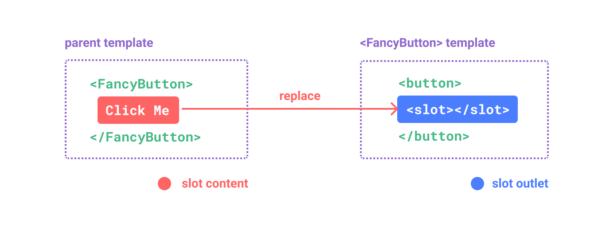
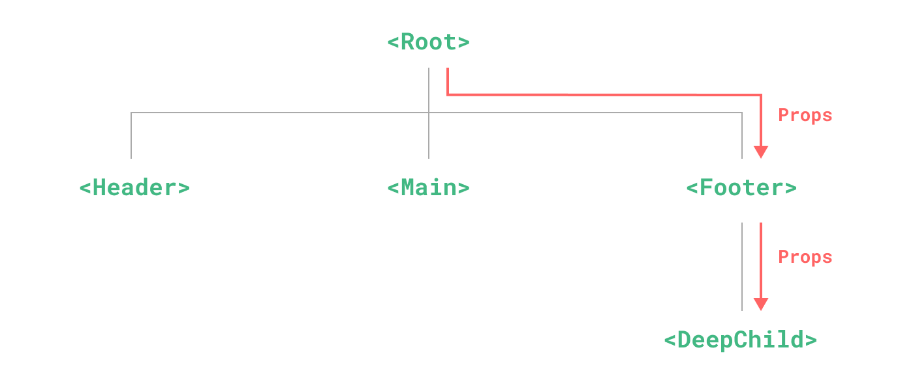
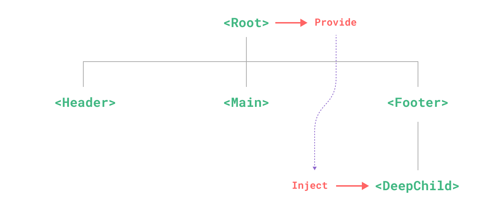

### 1. Slots

Trước đó chúng ta đã cùng tìm hiểu về **`Props`** trong vue, chúng ta có thể truyền props cho component và hiển thị giá trị props trong template. Tuy nhiên lúc này chúng ta lại muốn truyền vào một đoạn template vào component này, suy nghĩ tới việc truyền props thì lại rất rườm rà, phức tạp. Máy mắn thay Vue đã giúp đỡ chúng ta điều bằng cách cung cấp `<slot></slot>` trong template.

#### 1.1. Slot cơ bản

Chúng ta hãy cùng tìm hiểu sâu hươn về `<slot>` element mà Vue cung cấp nhé



Hãy cùng nhau phân tích hình ảnh phía trên được cung cấp bởi Vue

- Hình ảnh bên trái: đây chính là template của một component đặt tên là `FacyButton`. Và phần sử dụng `<slot></slot>` được bôi xanh được gọi là **`slot outlet`**
- Hình ảnh bên phải: Đây chính là khi ta sử dụng component `FancyButton` ở component cha. Phần nội dung **`Click Me`** được bôi đỏ chính là **`slot content`**

👉 **Mình sẽ giải thích như sau**:
Hiểu đơn giản là khi bạn dùng component `FancyButton` và truyền cho nó nội dung `Click Me`. Khi này `<slot></slot>` trong template của component `FancyButton` sẽ được thay thế, hứng lấy nội dung `Click Me`. Cuối cùng ta nhận được kết quả là `<button>Click Me</button>`

#### 1.2. **Chúng ta sử dụng slot như thế nào?**

**`SlotComponent.vue`**

```html
<template>
  <button class="btn">
    <slot></slot>
  </button>
</template>
```

**ParentComponent.vue**

```html
<script>
  import SlotComponent from "./SlotComponent.vue";
</script>
<template>
  <slot-component>
    <p class="msg">Click me again!!!</p>
  </slot-component>
</template>
```

**Kết quả nhận được trên DOM**

```html
<button class="btn">
  <p class="msg">Click me again!!!</p>
</button>
```

Bạn nắm được cách Slot hoạt động rồi chứ? Khá đơn giản phải không?

#### 1.3. Fallback content

`Fallback content` này mình tin sẽ không làm khó được bạn. Hiểu đơn giản thì `Fallback content` giống như content mặc định trong `<slot></slot>` khi bạn không truyền template gì khi sử dụng component.

Hãy xem ví dụ sau để hiểu rõ hơn về `Fallback content`

**`SlotComponent.vue`**

```html
<template>
  <button class="btn">
    <slot> Submit </slot>
  </button>
</template>
```

Có phải bạn đã nhận ra rằng bên trong `<slot></slot>` xuất hiện content là `Submit` đúng không? Đây chính là `Fallback content`, content mặc định của slot

**ParentComponent.vue**

- **TH1**: Sử dụng `SlotComponent` và truyền cho nó một đoạn template ngắn

  ```html
  <script>
    import SlotComponent from "./SlotComponent.vue";
  </script>
  <template>
    <slot-component>
      <p class="msg">Click me again!!!</p>
    </slot-component>
  </template>
  ```

  **Kết quả nhận được trên DOM**

  ```html
  <button class="btn">
    <p class="msg">Click me again!!!</p>
  </button>
  ```

- **TH1**: Sử dụng `SlotComponent` và không truyền gì

  ```html
  <script>
    import SlotComponent from "./SlotComponent.vue";
  </script>
  <template>
    <slot-component />
  </template>
  ```

  **Kết quả nhận được trên DOM**

  ```html
  <button class="btn">Submit</button>
  ```

Bạn đã nhận ra điều khác biết rồi chứ?

### 2. Provide / Inject



Bây giờ giả sử trong dự án Vue của bạn có nhưng component như hình trên và bạn muốn truyền dữ liệu từ `<Root>` và sử dụng nó ở `<DeepChild>`, tôi sẽ khuyên ban sử dụng `Props` để truyền dữ liệu từ `<Root>` xuống `<Footer>` rồi truyền tiếp xuống `<DeepChild>`.

Cách này hoạt động được tuy nhiên lại mắc phải 1 vấn đề đó là ở `<Footer>` bạn lại định nghĩa ra `props` mà không cần dùng tới nó.

Bây giờ hãy thử tưởng tưởng có vài chục Component nối liền nhau như vậy, bạn muốn truyền dữ liệu từ component 1 tới component 10 nhưng mà bạn lại rất **LƯỜI**! Bạn không muốn làm điều đó...

Và để hỗ trợ cái lười đó của bạn, Vue cung cấp `provide` và `inject`



Khi thằng cha `provide` dữ liệu, thì bất cứ thằng con, cháu, chắt, chút, chít có quan hệ gia phả với thằng cha cũng đều có thể `inject` dữ liệu

#### 2.1. Provide

Để có thể `provide` dữ liệu, ta sử dụng tới hàm `provide()` cung cấp bởi Vue

```html
<script setup>
  import { provide } from "vue";
  provide(/* key */ "message" /* value */, "hello!");
</script>
```

Hãy chú ý một chút ở đây, hàm `provide()` yêu cầu 2 đối số

- **injection key**: Đây là đối số đầu tiên, là một string giúp xác định được khi nhận dữ liệu ở thằng con. Ở ví dụ trên **injection key** là `message`
- **value**: Đây chính là giá trị mà thằng cha sẽ cung cấp cho con. Kiểu giá trị truyền vào ở đây có thể là bất kì kiểu nào nhé, kể cả là một biến phản ứng. Gía trị cung cấp ở đây là `hello!`

Trong một component chúng ta có thể `provide` nhiều lần với từ khóa khác nhau để truyền nhiều dữ liệu khác nhau cho các con của nó

#### 2.2. Inject

Để nhận giá trị cung cấp từ cha, ta sử dụng hàm `inject()` cung cấp bởi Vue

```html
<script setup>
  import { inject } from "vue";
  const message = inject("message");
</script>
```

Với hàm `inject()` của chúng ta, bạn chỉ cần truyền vào **injection key** mà bạn đã định nghĩa bằng `provide()` ở thằng cha. Còn nếu **injection key** không có thì thằng con đơn giản là nhịn đói, nhận giá trị `undefined`

Từ đoạn code trên, chúng ta cũng có thể đoán được rằng lúc này giá trị của biến `message` là `hello!` vì nó đã dùng tới **injection key** ta đã định nghĩa ở trên

Một điều nữa đó là nếu nhiều cha cung cấp cho con những cái **injection key** giống nhau thì thằng con sẽ lấy giá trị của thằng cha gần nhất cung cấp cho nó.

Ví dụ như ông nội cho cháu 5 cái **bánh quy**, nhưng thằng cha lại cho con 10 cái **bánh quy**, cùng là **bánh quy** nhưng thằng con lại không thể lấy cả 15 cái mà chỉ có thể lấy 10 cái **bánh quy** từ thằng cha thôi.

#### 2.3. Ở đây chỉ có ví dụ và giải thích

- Ví dụ 1:
  **`Parent.vue`**

  ```html
  <!-- Parent.vue -->
  <script setup>
    import { ref, provide } from "vue";

    const count = ref(0);
    provide("count", count);
  </script>

  <template>
    <div>
      Parent count: {{ count }}
      <Child />
    </div>
  </template>
  ```

  **`Child.vue`**

  ```html
  <!-- Child.vue -->
  <script setup>
    import { inject } from "vue";

    const count = inject("count");

    function increase() {
      count.value++;
    }
  </script>

  <template>
    <div>
      Child count: {{ count }}
      <button @click="increase">Increase</button>
    </div>
  </template>
  ```

  Bạn hay sử dụng 2 component trên vào dự án của mình, và xem kết như thế nào nha

  Ảo lắm đúng không bạn? Bạn `provide` dữ liệu ở cha, `inject` dữ liệu ở con, thay đổi dữ liệu `inject` ở con thế mà ở cha lại thay đổi được luôn. Đủ wow chưa người đẹp!?

  Chà chà, `provide/inject` trong Vue không phải copy giá trị, mà là truyền tham chiếu (reference).

  Nếu bạn provide một `ref` hoặc một `reactive`, inject ở component con thực chất đang nhận đúng cái reference đó.

  Khi component con thay đổi dữ liệu, thì cha cũng nhìn thấy sự thay đổi đó ngay lập tức.

- Ví dụ 2:
  **`Parent.vue`**

  ```html
  <!-- Parent.vue -->
  <script setup>
    import { provide, ref } from "vue";

    const location = ref("North Pole");

    function updateLocation() {
      location.value = "South Pole";
    }

    provide("location", {
      location,
      updateLocation,
    });
  </script>
  ```

  Chú ý nhé, thằng cha này đang cung cấp cho thằng con một đối tượng gồm 1 biến phản ứng là `location` và hàm `updateLocation`

  **`Child.vue`**

  ```html
  <!-- Child.vue -->
  <!-- in injector component -->
  <script setup>
    import { inject } from "vue";

    const { location, updateLocation } = inject("location");
  </script>

  <template>
    <button @click="updateLocation">{{ location }}</button>
  </template>
  ```

  Bởi vì thằng cha cung cấp một đối tượng nên ở thằng con đang `destructuring` `inject` với key là `location` để lấy ra `location` và hàm `updateLocation`

  Khi click button sẽ gọi hàm `updateLocation` và hàm này trong thằng cha chính là thay đổi giá trị của biến `location` và biến location sẽ có giá trị mới là `South Pole`

  Lúc này bạn hãy chạy chương trình để xem kết quả như thế nhé
